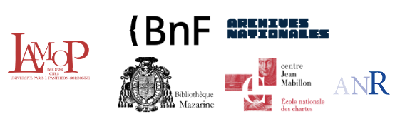

e-NDP corpus processing
===

## e-NDP project

ANR project blog: [https://endp.hypotheses.org/](https://endp.hypotheses.org/)

The e-NDP project, funded by the ANR, is led by the LaMOP (Julie Claustre and Darwin Smith).

The project's partners are the Archives nationales, la Bibliothèque nationale de France (Department of Manuscripts, Bibliothèque de l'Arsenal), the École nationale des chartes and the Bibliothèque Mazarine.

**création, maintenance : Sergio Torres**

## HTR post-processing

Tools to clean the HTR output.